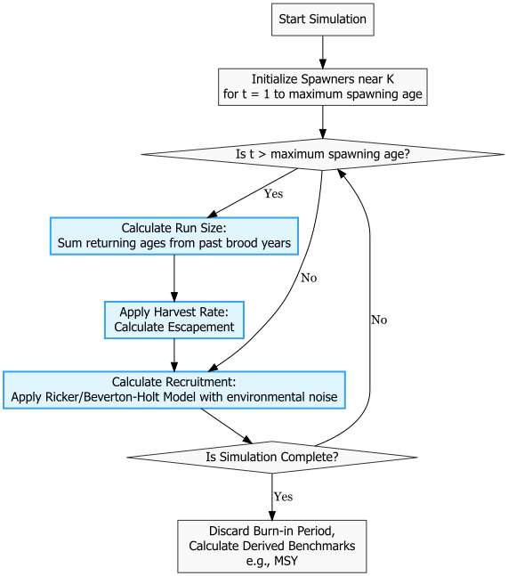

---
word_document:
  toc: true
author:
- name: Maria Kuruvilla
author_summary: null
output:
  html_document:
    df_print: paged
  word_document: null
  pdf_document: default
bibliography: mybibfile.bib
csl: http://www.zotero.org/styles/plos
title: "Parameter estimation in fishery models"
---

```{r setup, include=FALSE}
knitr::opts_chunk$set(warning = FALSE, echo = FALSE)
knitr::opts_chunk$set(warning = FALSE)
knitr::opts_chunk$set(cache=FALSE)
knitr::opts_chunk$set(fig.width=7, fig.height=5)
options(max.print=23)
library(here);library(dplyr); library(stringr)
library(ggplot2)
library(tidyverse)
library(bayesplot)
library(patchwork)
library(hues)
library(GGally)
library(latex2exp)
library(ggforce)
library(PNWColors)

pal <- PNWColors::pnw_palette("Starfish", 5)

```

<!-- _Text based on plos sample manuscript, see <https://journals.plos.org/ploscompbiol/s/latex>_ -->

# Introduction

Fish population dynamics models have been used for several decades to describe the relationship between spawner abundance and future recruitment. The parameters in these models are estimated and used to predict the population size in the future, to manage fisheries, and more recently to understand factors (physical, biological, or human) that cause changes in fish populations. However, the parameters in these complex models may not be uniquely identifiable. We used simulations, profile likelihood, and Bayesian hierarchical modelling to check the limitations of commonly used fisheries models, such as the Ricker and the Beverton-Holt model. We provide some guidelines on the most appropriate use cases for these models.

### Beverton-Holt Equation

$\ln(\frac{R}{S}) = e^{\alpha} - \ln(1 + \frac{e^{\alpha} S}{R_k}) + \beta SST + \epsilon$

$R_K = \frac{K}{e^{\alpha}-1}$

$\epsilon \sim N(0,\sigma)$

### Ricker Equation

$\ln(\frac{R}{S}) = \alpha - \frac{S}{S_{max}} + \beta SST + \epsilon$

$S_{max} = \frac{K}{\alpha}$

$\epsilon \sim N(0,\sigma)$

## Simulation

<!-- We simulated data for log recruits per spawner $\ln(\frac{R}{S})$, also known as productivity, with the Beverton-Holt equation and the Ricker equation with randomly drawn values of $\alpha$, $\sigma$, $K$, and with empirical spawner data. We then fit both the Beverton-Holt model and the Ricker model in Bayesian framework to this data to estimate the same parameters. We plotted the median estimates of these parameters with  95% credible intervals along with the true values of the parameters to evaluate the accuracy and precision of the parameter estimates.  -->

We simulated the population dynamics of salmon using two spawner recruit models - Ricker and Beverton-Holt. The simulation models containied submodels for recruitment, harvest and age-structure, with natural variability in recruitment, harvest, and age-at-maturity.

### Base model

### Beverton-Holt Equation

$\ln(\frac{R}{S}) = e^{\alpha} - \ln(1 + \frac{e^{\alpha} S}{R_k}) + \epsilon$

$R_K = \frac{K}{e^{\alpha}-1}$

$S_{MSY} =  \frac{K}{e^{\frac{\alpha}{2}}+1}$

$\epsilon \sim N(0,\sigma)$

### Ricker Equation

$\ln(\frac{R}{S}) = \alpha - \frac{S}{S_{max}} + \epsilon$

$S_{max} = \frac{K}{\alpha}$

$S_{MSY} =  (1-W_0(e^{1 - \alpha}))S_{max}$

$\epsilon \sim N(0,\sigma)$


```{r flowchart, echo=FALSE, message=FALSE, warning=FALSE}
library(DiagrammeR)
library(DiagrammeRsvg)
library(rsvg)
library(magrittr)

# 1. Create the graph using Graphviz
flowchart <- grViz("
digraph G {
  graph [layout = dot, rankdir = TD]

  # Default nodes
  node [shape = box, style = filled, fillcolor = '#f9f9f9', fontname = 'Helvetica', color = '#333333']
  A [label = 'Draw Parameters']
  B [label = 'Initialize Spawners near K\\nfor t = 1 to maximum spawning age']
  H [label = 'Post Processing\\ndiscard first 50 years, calculate $S_{MSY}$']

  # Decision nodes (diamonds)
  node [shape = diamond, fillcolor = '#f9f9f9']
  C [label = 'Is t > maximum spawning age?']
  G [label = 'Is Simulation Complete?']

  # Process nodes (blue)
  node [shape = box, fillcolor = '#e1f5fe', color = '#36a2eb', penwidth = 2]
  D [label = 'Calculate Run Size:\\nSum returning ages from past brood years']
  E [label = 'Apply Harvest Rate:\\nCalculate Escapement']
  F [label = 'Calculate Recruitment:\\nApply spawner recruitment model']

  # Connect the arrows
  A -> B
  B -> C
  C -> D [label = ' Yes']
  D -> E
  C -> F [label = ' No']
  E -> F
  F -> G
  G -> C [label = ' No']
  G -> H [label = ' Yes']
}
")

# 2. Convert the graph to a PNG image and save it to your folder
export_svg(flowchart) %>% charToRaw() %>% rsvg_png("simulation_flowchart.png")

# 3. Insert the PNG image into the Word document

```


```{r echo=FALSE, message=FALSE, warning=FALSE}

simulation_results_diff_pars <- read_csv(here("simulation",
                                              "stan_models",
                                              "output",
                                              "simulation_fitting_results_w_age_sim_383.csv"))

 
ggplot(simulation_results_diff_pars %>% 
         filter(parameter == "alpha"), aes(x = alpha, y = estimate_median)) +
  # geom_point(aes(color = alpha),alpha = 0.5, size = 2) +
  geom_pointrange(aes(ymin= estimate_lower, ymax = estimate_upper, color = Smsy), size = 0.5, alpha = 0.5)+
  geom_abline(slope = 1, intercept = 0, linetype = "dashed") +
  facet_wrap(~ paste("Data model: ",generating_model) + paste("Fitting model: ",fitting_model)) +
  labs(x = "True alpha", y = "Estimated alpha") +
  # scale_color_gradient2(name = 'alpha',
  #                       low = pal[2], mid = 'gray', high = pal[4], midpoint = 5) +
  scale_color_gradientn(name = 'Estimated S_msy',
                        colors = pal)+
  theme_classic()


```


```{r echo=FALSE, message=FALSE, warning=FALSE}

simulation_results_same_pars <- read_csv(here("simulation",
                                              "stan_models",
                                              "output",
                                              "simulation_fitting_results_w_age_same_pars_1000.csv"))

simulation_results_same_pars %>%
  ggplot() +
  # geom_histogram(aes(x = alpha_estimate, fill = fitting_model), position = "dodge", bins = 30) +
  geom_density(aes(x = alpha_estimate, fill = fitting_model, lty = generating_model), alpha = 0.5, color = "black") +
  geom_vline(aes(xintercept = alpha, color = "alpha"), lty = "dashed", size = 1) +
  labs(title = "Distribution of alpha estimates for BH and Ricker fitting models", x = "Alpha estimate", y = "Density") +
  scale_fill_manual(name = "Fitting model", values = c( "#807182","#99C2A2")) +
  scale_color_manual(name = "True value", values = c("alpha" = "slategray")) +
  scale_linetype_manual(name = "Generating model", values = c("Beverton-Holt" = "solid", "Ricker" = "dashed")) +
  theme_classic()

simulation_results_same_pars %>%
  filter(fitting_model == "Ricker") %>% 
  ggplot() +
  # geom_histogram(aes(x = alpha_estimate, fill = fitting_model), position = "dodge", bins = 30) +
  geom_density(aes(x = alpha_estimate, fill = generating_model), alpha = 0.5, color = NA) +
  geom_vline(aes(xintercept = alpha, color = "alpha"), lty = "dashed", size = 1) +
  labs(title = "Distribution of alpha estimates for Ricker fitting model", x = "Alpha estimate", y = "Density") +
  scale_fill_manual(name = "Generating model", values = c( "#807182","#99C2A2")) +
  scale_color_manual(name = "True value", values = c("alpha" = "slategray")) +
  theme_classic()


```


```{r echo=FALSE, message=FALSE, warning=FALSE}

simulation_results_diff_pars_w_covariate <- read_csv(here("simulation",
                                              "stan_models",
                                              "output",
                                              "simulation_fitting_results_w_covariates_100.csv"))

 
ggplot(simulation_results_diff_pars_w_covariate %>% 
         filter(parameter == "alpha"), aes(x = alpha, y = estimate_median)) +
  # geom_point(aes(color = alpha),alpha = 0.5, size = 2) +
  geom_pointrange(aes(ymin= estimate_lower, ymax = estimate_upper, color = sigma), size = 0.5, alpha = 0.5)+
  geom_abline(slope = 1, intercept = 0, linetype = "dashed") +
  facet_wrap(~ paste("Data model: ",generating_model) + paste("Fitting model: ",fitting_model)) +
  labs(x = "True alpha", y = "Estimated alpha") +
  # scale_color_gradient2(name = 'alpha',
  #                       low = pal[2], mid = 'gray', high = pal[4], midpoint = 5) +
  scale_color_gradientn(name = 'sigma',
                        colors = pal)+
  theme_classic()


 
ggplot(simulation_results_diff_pars_w_covariate %>% 
         filter(parameter == "alpha"), aes(x = alpha, y = estimate_median)) +
  # geom_point(aes(color = alpha),alpha = 0.5, size = 2) +
  geom_pointrange(aes(ymin= estimate_lower, ymax = estimate_upper, color = min_S), size = 0.5, alpha = 0.5)+
  geom_abline(slope = 1, intercept = 0, linetype = "dashed") +
  facet_wrap(~ paste("Data model: ",generating_model) + paste("Fitting model: ",fitting_model)) +
  labs(x = "True alpha", y = "Estimated alpha") +
  # scale_color_gradient2(name = 'alpha',
  #                       low = pal[2], mid = 'gray', high = pal[4], midpoint = 5) +
  scale_color_gradientn(name = 'min(Spawners)',
                        colors = pal)+
  theme_classic()


ggplot(simulation_results_diff_pars_w_covariate %>% 
         filter(parameter == "b_cov"), aes(x = b_cov, y = estimate_median)) +
  # geom_point(aes(color = alpha),alpha = 0.5, size = 2) +
  geom_pointrange(aes(ymin= estimate_lower, ymax = estimate_upper, color = sigma), size = 0.5, alpha = 0.5)+
  geom_abline(slope = 1, intercept = 0, linetype = "dashed") +
  facet_wrap(~ paste("Data model: ",generating_model) + paste("Fitting model: ",fitting_model)) +
  labs(x = "True alpha", y = "Estimated alpha") +
  # scale_color_gradient2(name = 'alpha',
  #                       low = pal[2], mid = 'gray', high = pal[4], midpoint = 5) +
  scale_color_gradientn(name = 'sigma',
                        colors = pal)+
  theme_classic()


```


To do:

-   Generate data using Spawner data from the RAM Legacy database.
    -   Include salmon and few other species. Check for data at low spawner levels.
-   Fit multiple reformulations of the Beverton-Holt model and Ricker model with carrying capacity, $S_{MSY}$.
-   Plot the estimates and true values of $\alpha$, $K$, $S_{MSY}$.
-   Generate data with sea-surface temperature (SST) covariate and estimate the effect of SST on productivity, $\beta$.
    -   Plot the estimates and true values of $\beta$.
-   Generate multiple datasets for the same values of $\alpha$, $K$ and plot the distribution of estimated medians.

## Profile Likelihoods

Profile likelihood is a statistical tool that can be used to determine whether a parameter is identifiable, practically unidentifiable, or structurally unidentifiable [@Raue_2009]. We plot the profile likelihood of $\alpha$, and $K$ parameters of both the Ricker model and the Beverton-Holt model after fitting these models to data generated from both the Beverton-Holt equation and the Ricker equation.

To do:

-   Generate multiple datasets with data at low and high spawner levels
-   Plot the profile likelihood of the model parameters for multiple datasets

## Significance

The Beverton-Holt model and the Ricker model differ in their assumptions about density-dependence at high spawner levels. The structural differences in the two models lead to variation in parameter estimation. The Beverton-Holt model usually overestimates $\alpha$ and carrying capacity while the Ricker model usually underestimates them [@Zhou_2007]. While the Beverton-Holt model is usually a better statistical fit, the Ricker model is usually recommended because it is less sensitive to the priors and as a precautionary option to avoid over harvesting [@Godbout_Fu_Irvine]. A failure to represent population dynamics accurately can result in endangering populations by overharvesting and also loss of credibility in the modelling process.

Using a Bayesian approach allows us to quantify the full uncertainty associated with all parameters and metrics of interest, such as harvest targets. However, having high levels of uncetainty are unhelpful with management decisions. It is useful to know when the model structure leads to high levels of uncertainty in the parameters and metrics of interest. We can then use this information to make informed decisions about which model to use for specific datasets and to be cautious about the interpretation of the results.

<!-- # Introduction -->

<!-- # Methods -->

<!-- # Results -->

<!-- # Discussion -->

# References {#references .unnumbered}
